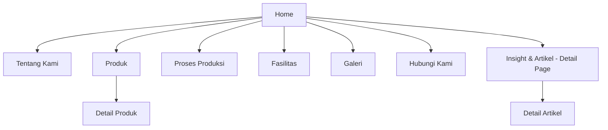

# 01 — Product Requirements Document (PRD)
**Proyek:** Website Company Profile — CV Putri Palma Nusantara (PPN)
**Jenis Dokumen:** Product Requirements Document
**Status:** Final — menjadi acuan tunggal (single source of truth) bagi seluruh dokumen turunan (02–07)

---

## 1. Ringkasan Proyek

CV Putri Palma Nusantara (PPN) adalah perusahaan eksportir produk turunan kelapa Indonesia (Semi Husked Coconut, Copra, Coconut Shell Charcoal, Coconut Timber). PPN membutuhkan website company profile berkelas internasional untuk membangun kepercayaan buyer B2B luar negeri, menampilkan kapabilitas produksi, dan menghasilkan permintaan penawaran (Request Quotation) dari importir, distributor, wholesaler, food manufacturer, dan trading company di kawasan Asia, Timur Tengah, dan Eropa.

Website ini **bukan** sistem operasional internal (bukan ERP, dashboard operasional, inventory system, buyer portal, supplier portal, CRM, marketplace, atau sistem tracking/CocoTrace). Website murni berfungsi sebagai **digital storefront kepercayaan (trust storefront)** dengan CMS sederhana untuk admin.

---

## 2. Latar Belakang Perusahaan

| Aspek | Deskripsi |
|---|---|
| Nama Perusahaan | CV Putri Palma Nusantara (PPN) |
| Industri | Ekspor produk olahan kelapa |
| Produk Utama | Semi Husked Coconut, Copra, Coconut Shell Charcoal, Coconut Timber |
| Model Bisnis | B2B Export — kontrak/penawaran melalui quotation, bukan e-commerce |
| Target Pasar | Thailand, Malaysia, China, India, Middle East, Europe |
| Kompetitor Tidak Langsung (referensi struktur) | djavacoal.com (hanya referensi UX/struktur, dilarang ditiru secara visual) |

---

## 3. Tujuan Bisnis (Business Goals)

| # | Tujuan | Indikator Keberhasilan |
|---|---|---|
| 1 | Branding perusahaan kelas internasional | Persepsi profesionalisme meningkat, konsisten dengan visual identity |
| 2 | Membangun kepercayaan buyer (trust building) | Peningkatan jumlah Request Quotation yang qualified |
| 3 | Menampilkan profesionalitas & kapabilitas produksi | Konten fasilitas & proses produksi lengkap dan kredibel |
| 4 | Menampilkan katalog produk secara detail | Setiap produk memiliki spesifikasi, packaging, aplikasi, dan dokumen unduh |
| 5 | Menjelaskan proses produksi end-to-end | Timeline proses produksi mudah dipahami buyer awam sekalipun |
| 6 | Mendapatkan leads berkualitas (Request Quotation) | Form quotation mudah diakses dari seluruh halaman kunci |
| 7 | SEO & visibilitas pencarian internasional | Lighthouse SEO ≥ 95, ranking untuk kata kunci ekspor kelapa |

---

## 4. Problem Statement

Buyer internasional pada industri komoditas ekspor **sangat mengandalkan first impression digital** sebelum melakukan kontak lebih lanjut atau kunjungan pabrik. Tanpa website yang profesional, transparan, dan informatif, PPN berisiko:

- Kehilangan kredibilitas dibandingkan kompetitor yang telah memiliki digital presence kuat.
- Kesulitan menjawab due-diligence awal buyer (kapasitas produksi, fasilitas, sertifikasi, dsb).
- Kehilangan potential leads karena tidak adanya kanal permintaan penawaran yang jelas.
- Sulit ditemukan melalui pencarian organik oleh buyer yang sedang riset supplier.

Website ini dirancang untuk menjawab seluruh permasalahan tersebut melalui pendekatan **desain premium, konten yang transparan, dan struktur informasi yang meyakinkan buyer B2B**.

---

## 5. Target Pengguna & Persona

### 5.1 Target Pengguna Utama

| Persona | Peran dalam Rantai Pasok | Kebutuhan Informasi Utama | Perilaku |
|---|---|---|---|
| Importir | Membeli langsung dari eksportir | Spesifikasi produk, kapasitas, sertifikasi, harga estimasi | Riset mandiri, minta quotation cepat |
| Distributor | Mendistribusikan ke pasar lokal negara tujuan | Konsistensi kualitas, kapasitas suplai berkelanjutan | Butuh bukti keandalan jangka panjang |
| Wholesaler | Membeli volume besar | Harga kompetitif, MOQ, packaging | Fokus pada efisiensi biaya & volume |
| Food Manufacturer | Menggunakan produk sebagai bahan baku | Sertifikasi mutu, konsistensi spesifikasi, proses QC | Sangat memperhatikan kualitas & higienitas |
| Trading Company | Perantara perdagangan internasional | Profil perusahaan, legalitas, kapasitas ekspor | Butuh kepercayaan cepat & dokumen pendukung |

### 5.2 Target Geografis

Thailand, Malaysia, China, India, Middle East, Europe.

> **Catatan Bahasa:** Karena seluruh target pasar berada di luar Indonesia, **bahasa utama konten publik website adalah Bahasa Inggris**. Panel admin (CMS) dapat menggunakan Bahasa Indonesia untuk kemudahan operasional tim internal. Ini merupakan asumsi resmi proyek dan berlaku konsisten di seluruh dokumen turunan.

---

## 6. Ruang Lingkup Proyek (Scope)

### 6.1 In Scope ✅

- Website Company Profile multi-halaman (bukan single-page)
- CMS Admin untuk mengelola konten (produk, artikel, galeri, homepage, kontak, statistik, pengaturan)
- Form Request Quotation & Contact
- SEO Technical Implementation (Schema.org, OpenGraph, Sitemap, dsb.)
- Halaman Insight & Artikel (blog sederhana, bukan menu utama)
- Integrasi WhatsApp click-to-chat & Email

### 6.2 Out of Scope ❌

| Fitur | Status |
|---|---|
| ERP | Dilarang |
| Dashboard operasional (produksi/inventory realtime) | Dilarang |
| Inventory Management | Dilarang |
| Buyer Portal (login buyer) | Dilarang |
| Supplier Portal | Dilarang |
| Fitur berbasis AI (chatbot AI, rekomendasi AI, dsb.) | Dilarang |
| CocoTrace / Traceability System | Dilarang |
| Tracking pengiriman (shipment tracking) | Dilarang |
| Marketplace / E-commerce checkout | Dilarang |
| CRM | Dilarang |

> **Catatan Kritis:** Batasan ini bersifat mengikat untuk seluruh dokumen turunan (02–07). Tidak ada dokumen lain yang boleh menambahkan fitur di luar daftar In Scope di atas.

---

## 7. Filosofi & Arah Desain (Ringkasan)

Detail lengkap ada di `03-design.md`. Ringkasan arah desain:

- Profesional, Modern, Minimalis, Natural, Premium, Internasional, Elegan, Responsif
- White space luas, grid modern, card minimalis, rounded corner, animasi ringan
- Referensi gaya (bukan ditiru): Apple, Tesla, Maersk, Flexport, Bloomberg, Notion, Vercel
- Dominasi warna putih; hijau (`#A4DC4A`) hanya sebagai aksen branding, tidak dominan

---

## 8. Struktur Situs (Sitemap Ringkas)

Struktur navigasi utama (menu bar): **Home · Tentang Kami · Produk · Proses Produksi · Fasilitas · Galeri · Hubungi Kami**

Artikel **bukan** menu utama, namun memiliki halaman detail tersendiri yang dapat diakses dari section "Insight & Artikel" di Homepage.

---

## 9. Metrik Keberhasilan (KPI)

| Kategori | Metrik | Target |
|---|---|---|
| Performa Teknis | Google Lighthouse — Performance | ≥ 95 |
| Performa Teknis | Google Lighthouse — SEO | ≥ 95 |
| Performa Teknis | Google Lighthouse — Accessibility | ≥ 95 |
| Performa Teknis | Google Lighthouse — Best Practice | ≥ 95 |
| Bisnis | Jumlah Request Quotation per bulan | Meningkat progresif (baseline ditentukan pasca-launch) |
| Bisnis | Conversion Rate (visitor → quotation request) | Dipantau via Google Analytics 4 |
| SEO | Ranking kata kunci ekspor produk kelapa | Masuk halaman 1 untuk kata kunci target dalam 6–12 bulan |
| UX | Bounce rate halaman produk | Menurun dari waktu ke waktu |

---

## 10. Asumsi & Ketergantungan

| # | Asumsi/Ketergantungan |
|---|---|
| 1 | Konten publik berbahasa Inggris; admin panel berbahasa Indonesia |
| 2 | Seluruh angka statistik (kapasitas produksi, jumlah container, dll.) dapat diubah melalui CMS |
| 3 | Tidak ada sistem pembayaran/e-commerce; seluruh transaksi terjadi di luar sistem (offline/negosiasi) |
| 4 | Video hero (drone footage) disediakan oleh klien atau dibuat oleh tim produksi konten |
| 5 | Website menggunakan arsitektur headless (frontend + backend API terpisah) — lihat `06-architecture.md` |
| 6 | CMS hanya memiliki 1 role: Admin. Tidak ada role buyer/publik yang login |

---

## 11. Stakeholder

| Peran | Tanggung Jawab |
|---|---|
| Product Owner (Klien — PPN) | Menentukan prioritas bisnis, menyediakan konten & aset (foto/video) |
| Product Manager | Menjaga konsistensi requirement di seluruh dokumentasi |
| UI/UX Designer | Merancang sistem desain & wireframe |
| Software Architect | Merancang arsitektur teknis |
| Frontend & Backend Engineer | Implementasi berdasarkan dokumentasi |
| SEO Specialist | Memastikan struktur SEO-ready |
| Copywriter & Technical Writer | Menyusun konten & dokumentasi |

---

## 12. Peta Dokumentasi Proyek

| Dokumen | Fokus |
|---|---|
| `01-prd.md` | Dokumen ini — kebutuhan produk tingkat tinggi |
| `02-requirements.md` | Requirement fungsional & non-fungsional detail per halaman |
| `03-design.md` | Design system lengkap (warna, tipografi, komponen, layout) |
| `04-database.md` | Struktur data & entitas CMS (konseptual, bukan SQL) |
| `05-api.md` | Kontrak API (endpoint, request/response) — tanpa implementasi |
| `06-architecture.md` | Arsitektur sistem, tech stack, deployment |
| `07-user-flow.md` | Alur pengguna (buyer & admin) dengan diagram |

---

## 13. Risiko & Mitigasi

| Risiko | Dampak | Mitigasi |
|---|---|---|
| Konten/foto/video belum tersedia saat development | Keterlambatan | Gunakan placeholder profesional, siapkan struktur CMS agar konten mudah diisi belakangan |
| Ekspektasi fitur di luar scope (mis. diminta fitur tracking) | Scope creep | Rujuk kembali ke Section 6.2 (Out of Scope) — bersifat final |
| Target Lighthouse 95+ sulit tercapai jika banyak media berat (video/gambar) | Performa turun | Wajib lazy loading, image optimization, video compression — lihat `03-design.md` & `06-architecture.md` |
| Ambiguitas bahasa konten | Inkonsistensi | Sudah diputuskan di Section 5.2 — bahasa Inggris untuk publik |

---

## 14. Acceptance Criteria (Level Produk)

- [ ] Seluruh menu utama (Home, Tentang Kami, Produk, Proses Produksi, Fasilitas, Galeri, Hubungi Kami) tersedia dan dapat dinavigasi
- [ ] Homepage mengikuti flow section yang telah ditentukan (lihat `02-requirements.md` Section Homepage)
- [ ] Tidak ada satupun fitur dari daftar Out of Scope yang terimplementasi
- [ ] CMS admin dapat mengelola: Produk, Artikel, Galeri, Homepage, Kontak, Download, Pengaturan
- [ ] Form Request Quotation dapat diakses minimal dari: Hero, Halaman Produk, Footer
- [ ] Website lulus audit Lighthouse dengan skor ≥ 95 pada seluruh kategori
- [ ] Struktur SEO teknis (schema, sitemap, OG tags) terpasang dan tervalidasi

---

## 15. Catatan Akhir

Dokumen ini adalah **acuan tertinggi**. Jika ditemukan pertentangan antara dokumen turunan (02–07) dengan dokumen ini, maka keputusan pada dokumen ini yang berlaku, kecuali terdapat detail teknis lebih spesifik di dokumen turunan yang **tidak bertentangan** secara prinsip.
