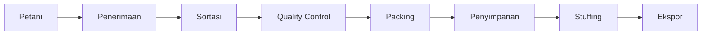

# 02 — Requirements Document

**Proyek:** Website Company Profile — CV Putri Palma Nusantara (PPN)
**Mengacu pada:** `01-prd.md`
**Cakupan:** Functional Requirements (per halaman/fitur) & Non-Functional Requirements

---

## 1. Functional Requirements per Halaman

### 1.1 Home

| ID | Requirement | Acceptance Criteria |
|---|---|---|
| FR-HOME-01 | Hero section dengan video drone (warehouse, container, semi husked coconut, loading) | Video autoplay muted, loop, memiliki fallback image untuk koneksi lambat, headline kuat + 2 CTA ("Request Quotation", "Lihat Produk") |
| FR-HOME-02 | Section Statistik Perusahaan | Menampilkan minimal: Jumlah Produk, Kapasitas Produksi, Jumlah Warehouse, Pengalaman (tahun), Jumlah Container terkirim. Semua angka diambil dari CMS |
| FR-HOME-03 | Section Tentang Kami (ringkas) | Ringkasan profil perusahaan + tombol "Selengkapnya" menuju halaman Tentang Kami |
| FR-HOME-04 | Section Mengapa Memilih PPN | Menampilkan 3–6 value proposition dalam bentuk card (misal: Kualitas Terjamin, Pengalaman Ekspor, Kapasitas Stabil, dsb.) |
| FR-HOME-05 | Section Produk Unggulan | Menampilkan card produk (min. 4 produk utama) dengan gambar, nama, ringkasan, tautan ke detail produk |
| FR-HOME-06 | Section Proses Produksi (ringkas) | Menampilkan timeline horizontal/vertikal ringkas dari proses produksi, tautan ke halaman lengkap |
| FR-HOME-07 | Section Fasilitas (ringkas) | Menampilkan highlight fasilitas dalam bentuk grid gambar + label |
| FR-HOME-08 | Section Galeri (ringkas) | Menampilkan preview galeri (grid foto/video), tautan ke halaman Galeri lengkap |
| FR-HOME-09 | Section Insight & Artikel | Menampilkan 3 artikel terbaru dalam card, tautan ke halaman detail artikel masing-masing |
| FR-HOME-10 | Section FAQ | Accordion FAQ (minimal 5 pertanyaan), dikelola dari CMS |
| FR-HOME-11 | Section Request Quotation | Form ringkas (Nama, Perusahaan, Negara, Email, Produk yang diminati, Pesan) sebelum Footer |
| FR-HOME-12 | Footer | Berisi kontak (WhatsApp, Email), navigasi ulang, tautan Request Quotation, alamat, social proof (jika ada), copyright |

> **Urutan section Homepage bersifat final** (lihat `01-prd.md` Section 8 & Homepage Flow di master prompt): Hero → Statistik → Tentang Kami → Mengapa Memilih PPN → Produk Unggulan → Proses Produksi → Fasilitas → Galeri → Insight & Artikel → FAQ → Request Quotation → Footer.

---

### 1.2 Tentang Kami

| ID | Requirement | Acceptance Criteria |
|---|---|---|
| FR-ABOUT-01 | Profil perusahaan lengkap | Sejarah singkat, visi misi, keunggulan kompetitif |
| FR-ABOUT-02 | Legalitas & sertifikasi (jika ada) | Ditampilkan sebagai badge/logo, dikelola via CMS |
| FR-ABOUT-03 | Nilai perusahaan (company values) | Ditampilkan dalam format card/list ikon |
| FR-ABOUT-04 | CTA Request Quotation | Muncul minimal 1 kali di halaman ini |

---

### 1.3 Produk

| ID | Requirement | Acceptance Criteria |
|---|---|---|
| FR-PROD-01 | Listing seluruh produk | Menampilkan 4 kategori produk utama: Semi Husked Coconut, Copra, Coconut Shell Charcoal, Coconut Timber, dalam grid card |
| FR-PROD-02 | Filter/kategori produk (opsional, jika jumlah produk berkembang) | Tidak wajib untuk versi awal (hanya 4 produk), namun struktur data mendukung ekspansi |
| FR-PROD-03 | Halaman detail produk | Setiap produk memiliki: Gallery, Specification, Packaging, Application, Download PDF, tombol Request Quotation |
| FR-PROD-04 | Gallery produk | Minimal 3 gambar per produk, mendukung lightbox |
| FR-PROD-05 | Specification | Ditampilkan dalam format tabel (mis. Moisture Content, Size, Color, dsb — field fleksibel via CMS) |
| FR-PROD-06 | Packaging Information | Deskripsi + gambar jenis kemasan (karung, jumbo bag, dsb.) |
| FR-PROD-07 | Application | Deskripsi penggunaan produk (industri makanan, bahan bakar, dsb.) |
| FR-PROD-08 | Download PDF | Tautan unduh spec sheet/brosur produk dalam format PDF |
| FR-PROD-09 | Request Quotation per produk | Form quotation ter-prefill dengan nama produk terkait |

---

### 1.4 Proses Produksi

| ID | Requirement | Acceptance Criteria |
|---|---|---|
| FR-PROC-01 | Timeline proses produksi lengkap | Menampilkan 8 tahap secara berurutan: Petani → Penerimaan → Sortasi → Quality Control → Packing → Penyimpanan → Stuffing → Ekspor |
| FR-PROC-02 | Deskripsi tiap tahap | Setiap tahap memiliki judul, deskripsi singkat, dan gambar/ikon pendukung |
| FR-PROC-03 | Visualisasi timeline responsif | Tampilan vertikal di mobile, horizontal/vertikal elegan di desktop |

---

### 1.5 Fasilitas

| ID | Requirement | Acceptance Criteria |
|---|---|---|
| FR-FAC-01 | Listing fasilitas | Menampilkan: Warehouse, Loading Area, Forklift, Weighbridge, Quality Control, Container Stuffing |
| FR-FAC-02 | Setiap fasilitas memiliki deskripsi + galeri foto | Minimal 1 foto per fasilitas, dikelola via CMS |
| FR-FAC-03 | Drone Gallery khusus fasilitas | Menampilkan foto/video udara fasilitas secara terpisah dari galeri umum |

---

### 1.6 Galeri

| ID | Requirement | Acceptance Criteria |
|---|---|---|
| FR-GAL-01 | Galeri foto & video terpusat | Mendukung kategori (Produk, Fasilitas, Proses Produksi, Drone) |
| FR-GAL-02 | Lightbox viewer | Klik gambar membuka viewer full-screen dengan navigasi next/prev |
| FR-GAL-03 | Lazy loading | Gambar dimuat secara progresif untuk menjaga performa |

---

### 1.7 Hubungi Kami

| ID | Requirement | Acceptance Criteria |
|---|---|---|
| FR-CONTACT-01 | Form kontak umum | Field: Nama, Perusahaan, Email, Negara, Pesan |
| FR-CONTACT-02 | Informasi kontak langsung | Alamat, nomor WhatsApp (click-to-chat), email, jam operasional |
| FR-CONTACT-03 | Peta lokasi (embed) | Menampilkan lokasi kantor/pabrik |
| FR-CONTACT-04 | Validasi form | Validasi client-side & server-side, pesan error jelas |
| FR-CONTACT-05 | Notifikasi submit | Email notifikasi ke admin + halaman/pesan konfirmasi ke pengguna |

---

### 1.8 Request Quotation (Fitur Lintas Halaman)

| ID | Requirement | Acceptance Criteria |
|---|---|---|
| FR-QUOTE-01 | Form quotation tersedia di: Hero Home, Section Request Quotation Home, Halaman Produk (per produk), Footer, Halaman Hubungi Kami | Konsisten secara desain, field dapat disesuaikan konteks (mis. produk ter-prefill) |
| FR-QUOTE-02 | Field minimum | Nama, Perusahaan, Negara, Email, No. Telepon/WhatsApp (opsional), Produk yang diminati, Estimasi Kuantitas (opsional), Pesan |
| FR-QUOTE-03 | Anti-spam | Wajib menggunakan mekanisme verifikasi (mis. CAPTCHA/honeypot) — detail teknis di `06-architecture.md` |
| FR-QUOTE-04 | Penyimpanan & notifikasi | Data tersimpan di database dan terlihat di CMS (menu Kontak/Quotation) + notifikasi email ke admin |

---

### 1.9 Insight & Artikel

| ID | Requirement | Acceptance Criteria |
|---|---|---|
| FR-ART-01 | Artikel muncul sebagai section di Homepage | Menampilkan 3 artikel terbaru |
| FR-ART-02 | Halaman detail artikel tersendiri | Dapat diakses via URL unik (slug), memiliki SEO meta sendiri |
| FR-ART-03 | Artikel dikelola penuh via CMS | Judul, konten (rich text), gambar cover, kategori, tanggal publish |
| FR-ART-04 | Artikel bukan menu navigasi utama | Tidak ditampilkan di top navigation bar, hanya via Homepage & internal link |

---

### 1.10 FAQ

| ID | Requirement | Acceptance Criteria |
|---|---|---|
| FR-FAQ-01 | FAQ dikelola via CMS | Admin dapat menambah/mengubah/menghapus pertanyaan & jawaban |
| FR-FAQ-02 | Tampilan accordion | Hanya 1 jawaban terbuka dalam satu waktu (opsional, tergantung UX final) |

---

## 2. CMS (Admin Panel) Requirements

| ID | Requirement | Acceptance Criteria |
|---|---|---|
| FR-CMS-01 | Admin Login | Autentikasi aman (lihat `06-architecture.md`), tidak ada registrasi publik |
| FR-CMS-02 | Dashboard ringkas | Menampilkan ringkasan: jumlah quotation baru, jumlah artikel, jumlah produk |
| FR-CMS-03 | Manajemen Produk | CRUD produk beserta gallery, specification, packaging, application, file PDF |
| FR-CMS-04 | Manajemen Artikel | CRUD artikel dengan rich text editor |
| FR-CMS-05 | Manajemen Galeri | Upload, kategorikan, hapus media |
| FR-CMS-06 | Manajemen Homepage | Mengatur statistik, FAQ, produk unggulan yang ditampilkan, urutan section (jika diperlukan) |
| FR-CMS-07 | Manajemen Kontak/Quotation | Melihat daftar submission, menandai status (baru/diproses/selesai) |
| FR-CMS-08 | Manajemen Download | Upload/ganti file PDF terkait produk |
| FR-CMS-09 | Pengaturan (Settings) | Data perusahaan, kontak, SEO default, integrasi (WhatsApp number, email tujuan) |
| FR-CMS-10 | Tidak ada login publik/buyer | Dipastikan tidak ada modul registrasi/login untuk pengguna eksternal |

---

## 3. Non-Functional Requirements

### 3.1 Performa

| ID | Requirement |
|---|---|
| NFR-PERF-01 | Google Lighthouse Performance ≥ 95 (desktop & mobile) |
| NFR-PERF-02 | Seluruh gambar menggunakan format modern (WebP/AVIF) dengan lazy loading |
| NFR-PERF-03 | Video hero dikompresi & disediakan dalam beberapa resolusi (adaptive) dengan poster image |
| NFR-PERF-04 | Core Web Vitals (LCP, CLS, INP) memenuhi ambang "Good" versi Google |

### 3.2 SEO

| ID | Requirement |
|---|---|
| NFR-SEO-01 | Implementasi Schema.org (Organization, Product, BreadcrumbList, FAQPage, Article) |
| NFR-SEO-02 | OpenGraph & Twitter Card di setiap halaman |
| NFR-SEO-03 | Dynamic XML Sitemap & robots.txt |
| NFR-SEO-04 | Canonical URL di setiap halaman |
| NFR-SEO-05 | Breadcrumb navigasi + markup terstruktur |
| NFR-SEO-06 | Image SEO: alt text wajib diisi (dikelola via CMS) |
| NFR-SEO-07 | Lighthouse SEO ≥ 95 |

### 3.3 Aksesibilitas

| ID | Requirement |
|---|---|
| NFR-A11Y-01 | Kontras warna teks memenuhi WCAG AA |
| NFR-A11Y-02 | Seluruh elemen interaktif dapat diakses via keyboard |
| NFR-A11Y-03 | Alt text pada gambar wajib |
| NFR-A11Y-04 | Lighthouse Accessibility ≥ 95 |

### 3.4 Responsivitas

| ID | Requirement |
|---|---|
| NFR-RESP-01 | Fully responsive: mobile, tablet, desktop, large desktop |
| NFR-RESP-02 | Breakpoint mengikuti sistem grid di `03-design.md` |

### 3.5 Keamanan

| ID | Requirement |
|---|---|
| NFR-SEC-01 | Admin panel dilindungi autentikasi & rate limiting |
| NFR-SEC-02 | Form publik (quotation/contact) dilindungi dari spam/bot |
| NFR-SEC-03 | Validasi input di sisi server untuk seluruh form |
| NFR-SEC-04 | HTTPS wajib di seluruh domain |

### 3.6 Kompatibilitas

| ID | Requirement |
|---|---|
| NFR-COMPAT-01 | Mendukung 2 versi terbaru browser utama (Chrome, Safari, Edge, Firefox) |
| NFR-COMPAT-02 | Tidak menggunakan library/gaya yang menyerupai template WordPress generik |

### 3.7 Maintainability

| ID | Requirement |
|---|---|
| NFR-MAINT-01 | Seluruh konten dinamis (produk, artikel, statistik, FAQ, galeri) dapat dikelola tanpa perubahan kode |
| NFR-MAINT-02 | Struktur kode & data konsisten dengan `04-database.md`, `05-api.md`, `06-architecture.md` |

---

## 4. Ringkasan Acceptance Criteria Global

- [ ] Semua Functional Requirements (Section 1–2) terimplementasi sesuai acceptance criteria
- [ ] Semua Non-Functional Requirements (Section 3) terverifikasi melalui audit (Lighthouse, manual QA)
- [ ] Tidak ada requirement yang bertentangan dengan `01-prd.md`
- [ ] Tidak ada fitur di luar daftar In Scope

## 5. Catatan

Dokumen ini bersifat mengikat untuk fase desain (`03-design.md`), data (`04-database.md`), API (`05-api.md`), arsitektur (`06-architecture.md`), dan alur pengguna (`07-user-flow.md`). Setiap perubahan requirement wajib direfleksikan secara konsisten di seluruh dokumen tersebut.
