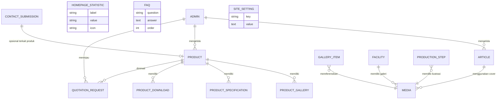

# 04 — Database Design Document

**Proyek:** Website Company Profile — CV Putri Palma Nusantara (PPN)
**Mengacu pada:** `01-prd.md`, `02-requirements.md`
**Catatan:** Dokumen ini bersifat **konseptual** (entity-relationship & field-level design). Tidak berisi implementasi SQL/DDL — implementasi teknis diserahkan kepada Database Engineer/Developer sesuai stack yang ditentukan di `06-architecture.md`.

---

## 1. Prinsip Desain Data

- Setiap entitas yang tampil di publik harus mendukung field SEO (meta title, meta description, slug) sesuai kebutuhan `02-requirements.md` NFR-SEO.
- Seluruh konten yang disebut "dikelola via CMS" pada `02-requirements.md` **wajib** memiliki entitas/tabel yang dapat diubah tanpa deployment ulang kode.
- Tidak ada entitas untuk user publik (buyer/importir) — hanya entitas `Admin` sebagai satu-satunya role pengguna sistem (sesuai `01-prd.md` Section 6.2, tidak ada Buyer Portal).
- Media (gambar/video/PDF) direferensikan melalui entitas `Media` terpusat agar dapat digunakan ulang (reusable) di berbagai entitas.

---

## 2. Entity Relationship Diagram (Konseptual)

---

## 3. Definisi Entitas & Field

### 3.1 `Admin`

| Field | Tipe (Konseptual) | Keterangan |
|---|---|---|
| id | Identifier | Primary key |
| name | String | Nama admin |
| email | String (unique) | Digunakan untuk login |
| password_hash | String | Disimpan terenkripsi (hash) |
| role | Enum (`super_admin`, `editor`) | Opsional, minimal 1 role default `admin` |
| last_login_at | Datetime | Untuk audit sederhana |
| created_at / updated_at | Datetime | Timestamp standar |

> **Catatan:** Tidak ada entitas `Buyer`/`User` publik. Ini konsisten dengan `01-prd.md` yang melarang Buyer Portal.

---

### 3.2 `Product`

| Field | Tipe | Keterangan |
|---|---|---|
| id | Identifier | Primary key |
| slug | String (unique) | Untuk URL, mis. `/produk/semi-husked-coconut` |
| name | String | Nama produk |
| category | Enum/String | Semi Husked Coconut, Copra, Coconut Shell Charcoal, Coconut Timber |
| short_description | Text | Ringkasan untuk card & homepage |
| full_description | Rich Text | Konten lengkap halaman detail |
| cover_image_id | Reference → Media | Gambar utama |
| meta_title / meta_description | String / Text | SEO |
| is_featured | Boolean | Untuk section "Produk Unggulan" di Homepage |
| status | Enum (`draft`, `published`) | Kontrol publikasi CMS |
| order | Integer | Urutan tampil |
| created_at / updated_at | Datetime | Timestamp |

### 3.3 `ProductGallery`

| Field | Tipe | Keterangan |
|---|---|---|
| id | Identifier | Primary key |
| product_id | Reference → Product | Relasi |
| media_id | Reference → Media | Gambar/video galeri produk |
| order | Integer | Urutan tampil |

### 3.4 `ProductSpecification`

| Field | Tipe | Keterangan |
|---|---|---|
| id | Identifier | Primary key |
| product_id | Reference → Product | Relasi |
| spec_key | String | Mis. "Moisture Content" |
| spec_value | String | Mis. "≤ 6%" |
| order | Integer | Urutan tampil di tabel spesifikasi |

> Desain field-value fleksibel ini memungkinkan setiap kategori produk memiliki spesifikasi berbeda tanpa perubahan skema.

### 3.5 `ProductPackaging` & `ProductApplication`

| Field | Tipe | Keterangan |
|---|---|---|
| id | Identifier | Primary key |
| product_id | Reference → Product | Relasi |
| type | Enum (`packaging`, `application`) | Membedakan konten |
| title | String | Judul singkat |
| description | Rich Text | Deskripsi |
| media_id | Reference → Media (nullable) | Gambar pendukung |

### 3.6 `ProductDownload`

| Field | Tipe | Keterangan |
|---|---|---|
| id | Identifier | Primary key |
| product_id | Reference → Product | Relasi |
| file_name | String | Nama file tampil |
| file_url | String | Path/URL file PDF |
| uploaded_at | Datetime | Timestamp |

---

### 3.7 `Article`

| Field | Tipe | Keterangan |
|---|---|---|
| id | Identifier | Primary key |
| slug | String (unique) | URL artikel |
| title | String | Judul artikel |
| excerpt | Text | Ringkasan untuk card |
| content | Rich Text | Isi artikel lengkap |
| cover_image_id | Reference → Media | Gambar cover |
| category | String (nullable) | Kategori artikel (opsional) |
| author | String | Nama penulis (opsional, default nama perusahaan) |
| meta_title / meta_description | String / Text | SEO |
| status | Enum (`draft`, `published`) | Kontrol publikasi |
| published_at | Datetime | Tanggal tayang |
| created_at / updated_at | Datetime | Timestamp |

---

### 3.8 `GalleryItem`

| Field | Tipe | Keterangan |
|---|---|---|
| id | Identifier | Primary key |
| media_id | Reference → Media | File gambar/video |
| category | Enum (`product`, `facility`, `production`, `drone`) | Kategori filter galeri |
| caption | String (nullable) | Keterangan singkat |
| order | Integer | Urutan tampil |

---

### 3.9 `Facility`

| Field | Tipe | Keterangan |
|---|---|---|
| id | Identifier | Primary key |
| name | String | Mis. "Warehouse", "Weighbridge" |
| description | Rich Text | Deskripsi fasilitas |
| cover_image_id | Reference → Media | Gambar utama |
| order | Integer | Urutan tampil |

---

### 3.10 `ProductionStep`

| Field | Tipe | Keterangan |
|---|---|---|
| id | Identifier | Primary key |
| title | String | Mis. "Sortasi" |
| description | Text | Deskripsi tahap |
| icon_or_image_id | Reference → Media (nullable) | Ilustrasi tahap |
| order | Integer | Urutan tahap (1 = Petani, 8 = Ekspor) |

---

### 3.11 `HomepageStatistic`

| Field | Tipe | Keterangan |
|---|---|---|
| id | Identifier | Primary key |
| label | String | Mis. "Kapasitas Produksi" |
| value | String | Mis. "5.000 Ton/Bulan" (string agar fleksibel format, mis. "+", "/bulan") |
| icon | String (nullable) | Referensi ikon |
| order | Integer | Urutan tampil |

---

### 3.12 `FAQ`

| Field | Tipe | Keterangan |
|---|---|---|
| id | Identifier | Primary key |
| question | String | Pertanyaan |
| answer | Rich Text | Jawaban |
| order | Integer | Urutan tampil |
| status | Enum (`draft`, `published`) | Kontrol tampil |

---

### 3.13 `QuotationRequest` (Contact/Quotation Submission)

| Field | Tipe | Keterangan |
|---|---|---|
| id | Identifier | Primary key |
| type | Enum (`quotation`, `general_contact`) | Membedakan sumber form |
| name | String | Nama pengirim |
| company | String | Nama perusahaan pengirim |
| country | String | Negara asal buyer |
| email | String | Email pengirim |
| phone | String (nullable) | No. telepon/WhatsApp |
| product_id | Reference → Product (nullable) | Produk yang diminati (jika dari halaman produk) |
| estimated_quantity | String (nullable) | Estimasi kuantitas |
| message | Text | Pesan/kebutuhan buyer |
| status | Enum (`new`, `in_progress`, `done`) | Status tindak lanjut internal |
| source_page | String | Halaman asal pengiriman form (untuk analitik) |
| created_at | Datetime | Timestamp submission |

---

### 3.14 `Media` (Media Library Terpusat)

| Field | Tipe | Keterangan |
|---|---|---|
| id | Identifier | Primary key |
| file_url | String | Path/URL file (gambar/video) |
| file_type | Enum (`image`, `video`, `pdf`) | Jenis media |
| alt_text | String | Wajib diisi untuk Image SEO (`NFR-SEO-06`) |
| width / height | Integer (nullable) | Untuk gambar, membantu mencegah layout shift (CLS) |
| uploaded_at | Datetime | Timestamp |

---

### 3.15 `SiteSetting`

| Field | Tipe | Keterangan |
|---|---|---|
| id | Identifier | Primary key |
| key | String (unique) | Mis. `company_name`, `whatsapp_number`, `contact_email`, `default_meta_title` |
| value | Text | Nilai pengaturan |
| group | String | Pengelompokan (mis. `contact`, `seo`, `general`) |

> Entitas ini menampung seluruh nilai yang "dapat diubah melalui CMS" sesuai `01-prd.md` Section Statistik & Pengaturan, termasuk nomor WhatsApp, email tujuan notifikasi, dan default SEO.

---

## 4. Pemetaan Entitas ke Modul CMS

| Modul CMS (`02-requirements.md` FR-CMS) | Entitas Terkait |
|---|---|
| Produk | `Product`, `ProductGallery`, `ProductSpecification`, `ProductPackaging`/`ProductApplication`, `ProductDownload` |
| Artikel | `Article` |
| Galeri | `GalleryItem`, `Media` |
| Homepage | `HomepageStatistic`, `FAQ`, `Product.is_featured` |
| Kontak | `QuotationRequest` |
| Download | `ProductDownload` |
| Pengaturan | `SiteSetting` |

---

## 5. Pertimbangan Indexing (Konseptual)

| Entitas | Field yang Disarankan untuk Index |
|---|---|
| Product | `slug` (unique), `status`, `is_featured` |
| Article | `slug` (unique), `status`, `published_at` |
| QuotationRequest | `status`, `created_at`, `product_id` |
| GalleryItem | `category` |
| Media | `file_type` |

---

## 6. Catatan Konsistensi

- Seluruh field bertanda "dikelola via CMS" pada dokumen ini **wajib** memiliki endpoint CRUD terkait di `05-api.md`.
- Struktur data ini tidak mengandung entitas apa pun yang berkaitan dengan fitur Out of Scope (ERP, Inventory, Tracking, Buyer Portal, CRM, Marketplace) — konsisten dengan `01-prd.md` Section 6.2.
- Implementasi fisik (tipe kolom SQL, constraint, migration) merupakan tanggung jawab tim development saat tahap coding, mengacu pada struktur konseptual di dokumen ini.
