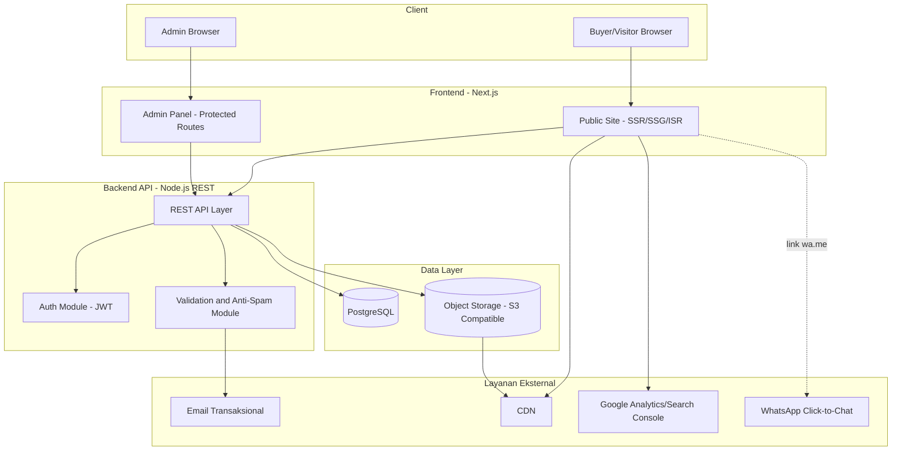
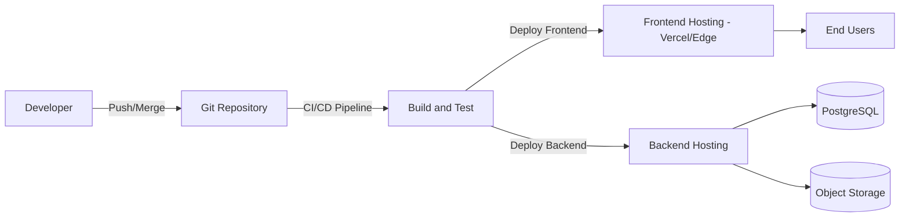

# 06 — Architecture Document

**Proyek:** Website Company Profile — CV Putri Palma Nusantara (PPN)
**Mengacu pada:** `01-prd.md`, `02-requirements.md`, `04-database.md`, `05-api.md`

---

## 1. Prinsip Arsitektur

- **SEO & Performance-first**: arsitektur harus mendukung target Lighthouse ≥ 95 di seluruh kategori (`NFR-PERF`, `NFR-SEO`).
- **Headless / Decoupled**: Frontend (public site + admin panel) terpisah secara logis dari Backend API, agar mudah dikembangkan, di-cache, dan diskalakan secara independen.
- **Sederhana & maintainable**: tidak ada kompleksitas berlebih (mis. microservices) karena skala proyek adalah company profile, bukan platform transaksional besar.
- **Tidak ada fitur di luar scope** (ERP, Inventory, Tracking, Marketplace, CRM, AI) — arsitektur tidak menyediakan modul untuk hal tersebut.

---

## 2. Tech Stack Rekomendasi

| Layer | Teknologi | Alasan |
|---|---|---|
| Frontend (Public Site + Admin Panel) | **Next.js (App Router)** + TypeScript + TailwindCSS | Mendukung SSR/SSG/ISR untuk SEO & performa tinggi, ekosistem matang, image optimization bawaan |
| Backend API | **Node.js (NestJS atau Express)** — REST API sesuai `05-api.md` | Konsisten dengan ekosistem JavaScript/TypeScript, mudah dipelihara satu tim |
| Database | **PostgreSQL** | Relasional, cocok untuk struktur data pada `04-database.md`, matang dan reliable |
| Media Storage | **Object Storage S3-compatible** (mis. Cloudflare R2 / AWS S3) + CDN | Menyimpan gambar/video/PDF secara terpisah dari server aplikasi, mendukung performa global |
| CDN & Image Optimization | Next.js Image Optimization + CDN Provider | Mendukung `NFR-PERF-02` (WebP/AVIF, lazy loading) |
| Email Transaksional | Penyedia email transaksional (mis. Resend/SendGrid) | Notifikasi Request Quotation & Contact ke admin |
| Autentikasi Admin | JWT (HTTP-only cookie) | Sesuai `05-api.md` Section 2 |
| Analytics | Google Analytics 4 + Google Search Console | Mengukur KPI pada `01-prd.md` Section 9 |
| Hosting Frontend | Vercel (atau setara) | Native untuk Next.js, mendukung ISR & edge caching |
| Hosting Backend & Database | VPS/Cloud (mis. Railway, Render, AWS) | Fleksibel untuk Node.js + PostgreSQL |

> **Catatan:** Rekomendasi stack ini bersifat panduan agar seluruh dokumen konsisten. Tim implementasi dapat menyesuaikan penyedia layanan spesifik selama prinsip arsitektur (headless, SSR/SSG, CDN media, REST API) tetap dipertahankan.

---

## 3. Diagram Arsitektur Tingkat Tinggi



---

## 4. Alur Permintaan Halaman Publik (Rendering Strategy)

| Jenis Halaman | Strategi Rendering | Alasan |
|---|---|---|
| Home | SSG + ISR (revalidate berkala, mis. tiap 60 menit atau on-demand saat CMS update) | Konten cukup sering berubah (statistik, artikel) namun tetap perlu kecepatan SSG |
| Detail Produk | SSG + ISR | Jarang berubah, wajib cepat & SEO-friendly |
| Detail Artikel | SSG + ISR (on-demand revalidate saat publish) | SEO artikel penting untuk trafik organik |
| Proses Produksi, Fasilitas, Galeri | SSG + ISR | Konten relatif statis |
| Hubungi Kami | SSR ringan (form perlu token anti-spam terbaru) | Interaktif |
| Admin Panel | CSR (Client-Side Rendering) di balik autentikasi | Tidak perlu SEO, prioritas interaktivitas |

> **On-demand revalidation**: setiap kali admin melakukan publish/update konten via CMS, backend memicu revalidation endpoint Next.js agar perubahan tampil tanpa menunggu interval cache — menjaga keseimbangan antara performa (SSG) dan kesegaran data (freshness).

---

## 5. Caching Strategy

| Layer | Strategi |
|---|---|
| CDN (edge) | Cache aset statis (gambar, video, CSS, JS) dengan `Cache-Control` panjang + hashing filename |
| Halaman (ISR) | Revalidate berkala + on-demand revalidation via webhook dari CMS |
| API Read-only | Cache singkat di edge/API gateway (mis. 60 detik) untuk endpoint seperti `/products`, `/faqs` |
| API Form Submission | Tidak di-cache (selalu fresh, wajib melewati validasi) |

---

## 6. Keamanan

| Aspek | Implementasi |
|---|---|
| Autentikasi Admin | JWT disimpan di HTTP-only, Secure cookie; expiry token wajar (mis. 8–24 jam) + refresh mechanism |
| Rate Limiting | Diterapkan di API gateway/middleware untuk login admin & form publik (`05-api.md` Section 8) |
| Anti-Spam Form Publik | CAPTCHA pihak ketiga (server-side validation) atau kombinasi honeypot + rate limiting (`FR-QUOTE-03`) |
| Validasi Input | Validasi server-side wajib di seluruh endpoint POST/PUT (`NFR-SEC-03`) |
| HTTPS | Wajib di seluruh domain (frontend & backend), redirect otomatis dari HTTP |
| Upload File | Validasi tipe file (image/video/pdf) & ukuran maksimum di endpoint `/admin/media` |
| Secrets Management | Kredensial (DB, JWT secret, API key pihak ketiga) disimpan di environment variable, tidak pernah di-hardcode |
| CORS | Backend hanya mengizinkan origin frontend resmi (public site & admin panel) |

---

## 7. SEO Technical Implementation (mendukung `NFR-SEO`)

| Kebutuhan | Implementasi Teknis |
|---|---|
| Schema.org | JSON-LD di-generate server-side per halaman (Organization di seluruh halaman, Product di detail produk, Article di detail artikel, FAQPage di section FAQ, BreadcrumbList di seluruh halaman dengan breadcrumb) |
| OpenGraph & Twitter Card | Meta tag dinamis per halaman, sumber dari field `meta_title`/`meta_description` (Product, Article) atau `SiteSetting` default |
| Sitemap Dinamis | Endpoint `/sitemap.xml` men-generate ulang berdasarkan data Product & Article published terbaru |
| Robots.txt | Statis dengan aturan disallow untuk path `/admin` |
| Canonical URL | Di-set otomatis berdasarkan slug halaman |
| Image SEO | Field `alt_text` wajib (validasi di CMS saat upload media) |
| Core Web Vitals | Next.js Image Optimization, font optimization (`next/font`), code-splitting otomatis, video hero dengan poster image & lazy load |

---

## 8. Struktur Modul (Konseptual, Bukan Kode)

```
project-root/
├── apps/
│   ├── web/              → Next.js: Public Site + Admin Panel (route group terpisah)
│   └── api/               → Node.js REST API (Backend)
├── packages/
│   ├── shared-types/       → Tipe data bersama (Product, Article, dsb. — konseptual)
│   └── ui-components/      → Komponen desain sesuai 03-design.md
```

> Struktur di atas bersifat ilustratif untuk memandu tim development; tidak mengikat tools monorepo tertentu.

---

## 9. Deployment Architecture



### 9.1 CI/CD (Ringkas)

| Tahap | Deskripsi |
|---|---|
| Lint & Type Check | Dijalankan otomatis pada setiap pull request |
| Automated Testing | Unit test backend (validasi, endpoint kritikal seperti form submission) |
| Build | Build Next.js (frontend) & Node.js (backend) |
| Deploy Staging | Auto-deploy ke environment staging untuk QA |
| Deploy Production | Manual approval sebelum deploy ke production |

---

## 10. Skalabilitas

- Frontend di-hosting di platform edge (mis. Vercel) sehingga dapat menangani lonjakan trafik tanpa konfigurasi tambahan.
- Backend API bersifat stateless (autentikasi berbasis token) sehingga dapat di-scale horizontal jika diperlukan di masa depan.
- Media disimpan di object storage + CDN, bukan di server aplikasi, sehingga tidak membebani backend saat trafik gambar/video tinggi.
- Database PostgreSQL tunggal sudah memadai untuk skala company profile; tidak diperlukan sharding pada tahap ini.

---

## 11. Integrasi Pihak Ketiga

| Integrasi | Tujuan | Catatan |
|---|---|---|
| WhatsApp Click-to-Chat (`wa.me`) | Kontak cepat buyer | Bukan integrasi API, hanya tautan langsung — sesuai larangan fitur kompleks di luar scope |
| Email Transaksional | Notifikasi Request Quotation/Contact ke admin | Dipicu oleh backend setelah submission berhasil |
| Google Analytics 4 & Search Console | Mengukur KPI (`01-prd.md` Section 9) | Dipasang di frontend |
| CAPTCHA Pihak Ketiga | Anti-spam form | Divalidasi di sisi server (`05-api.md` Section 6) |

---

## 12. Batasan Arsitektur (Selaras dengan Scope)

Arsitektur ini **secara sengaja tidak menyediakan**:

- Modul autentikasi/role untuk buyer publik
- Sistem inventory/stok real-time
- Sistem tracking pengiriman
- Integrasi AI/chatbot
- Modul pembayaran/e-commerce

Penambahan modul tersebut di masa depan (jika dibutuhkan) memerlukan revisi resmi terhadap `01-prd.md` terlebih dahulu.

---

## 13. Catatan

Arsitektur ini dirancang agar seluruh Non-Functional Requirements pada `02-requirements.md` (khususnya performa dan SEO) dapat tercapai tanpa kompleksitas berlebih, serta selaras penuh dengan struktur data (`04-database.md`) dan kontrak API (`05-api.md`).
