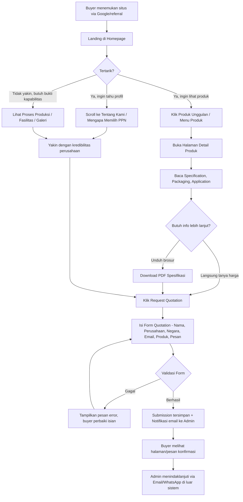
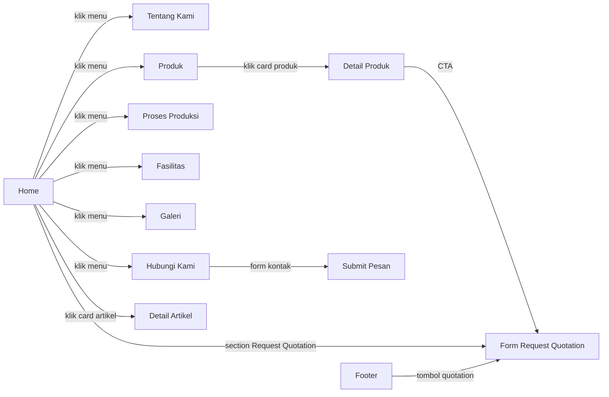
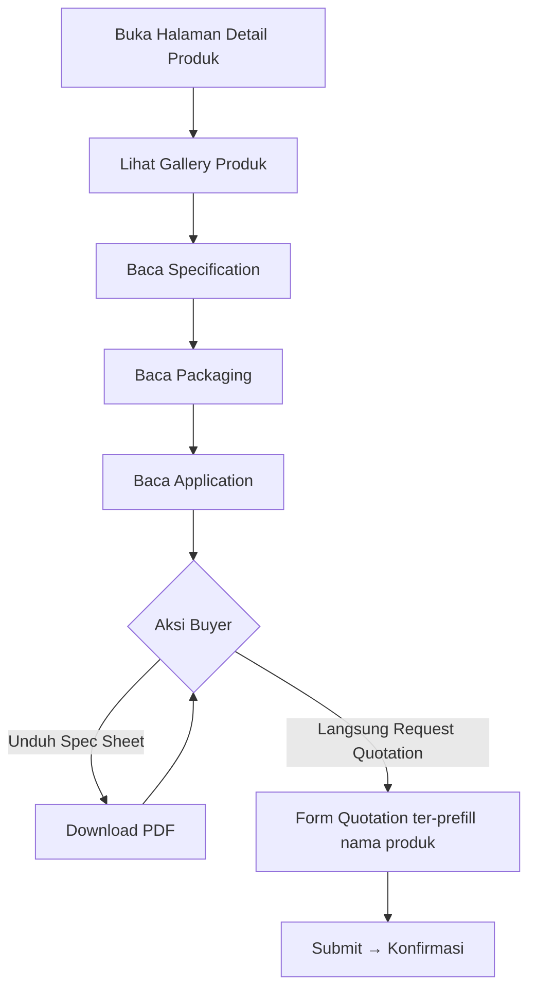
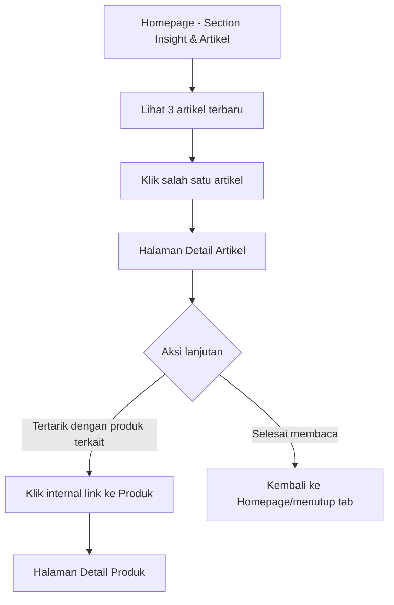
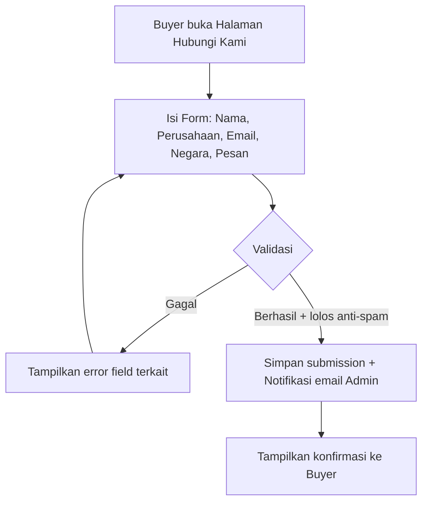
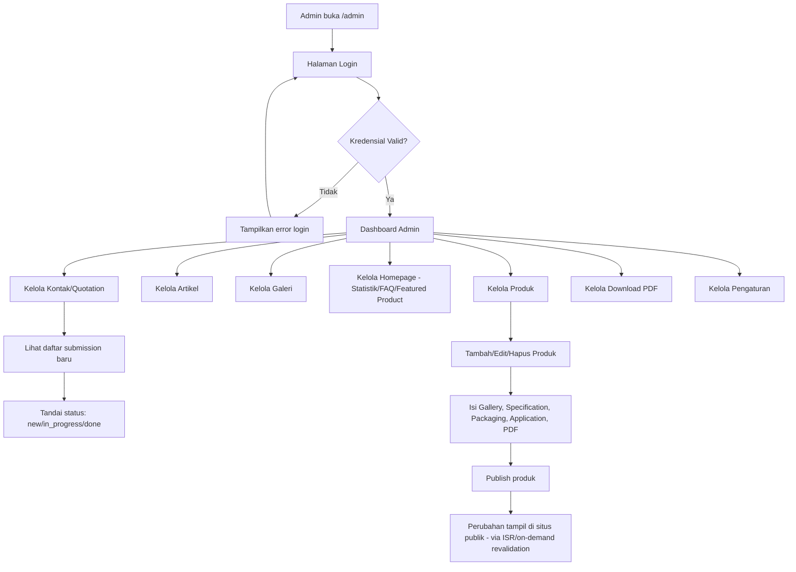
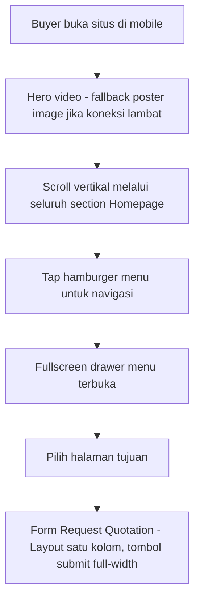

# 07 — User Flow Document

**Proyek:** Website Company Profile — CV Putri Palma Nusantara (PPN)
**Mengacu pada:** `01-prd.md`, `02-requirements.md`, `03-design.md`

---

## 1. Ringkasan Aktor

| Aktor | Deskripsi |
|---|---|
| Buyer/Visitor | Importir, distributor, wholesaler, food manufacturer, trading company yang mengunjungi situs publik |
| Admin | Pengelola konten internal PPN melalui CMS |

Tidak ada aktor lain (tidak ada Buyer Portal/login publik), sesuai `01-prd.md` Section 6.2.

---

## 2. Flow Utama — Buyer Journey (Discovery → Request Quotation)

### 2.1 Catatan Alur

- Tindak lanjut quotation (negosiasi, penawaran harga, kontrak) **terjadi di luar sistem** (email/WhatsApp manual oleh tim sales PPN) — sesuai batasan bahwa website bukan CRM/ERP.
- Buyer dapat masuk ke flow "Request Quotation" dari berbagai titik masuk (Hero, Section Homepage, Halaman Produk, Footer, Halaman Hubungi Kami) — lihat `02-requirements.md` FR-QUOTE-01.

---

## 3. Flow Detail — Navigasi Antar Halaman Publik

---

## 4. Flow — Halaman Detail Produk (Fokus Konversi)

---

## 5. Flow — Insight & Artikel

> Artikel bukan menu navigasi utama — akses hanya melalui Homepage atau internal link, sesuai `FR-ART-04`.

---

## 6. Flow — Form Hubungi Kami (Contact, Non-Quotation)

---

## 7. Flow — Admin CMS Journey

### 7.1 Catatan Alur Admin

- Setelah admin melakukan publish/update konten (produk, artikel, statistik, FAQ), sistem memicu revalidation agar perubahan tampil di situs publik tanpa deployment ulang (lihat `06-architecture.md` Section 4–5).
- Tidak ada flow registrasi admin baru secara mandiri melalui UI publik (penambahan admin dilakukan manual/terbatas) — mencegah celah keamanan.

---

## 8. Flow — Mobile Considerations

- Statistik counter, timeline proses produksi, dan galeri menyesuaikan menjadi layout vertikal/single-column di mobile (lihat `03-design.md` Section 9).
- Tap target minimal 44x44px untuk seluruh elemen interaktif (`03-design.md` Section 8).

---

## 9. Edge Cases & Skenario Alternatif

| Skenario | Penanganan |
|---|---|
| Buyer submit form quotation tanpa mengisi field wajib | Validasi client-side + server-side menampilkan pesan error spesifik per field |
| Buyer submit form berkali-kali dalam waktu singkat (indikasi spam/bot) | Rate limiting menolak request berlebih (`05-api.md` Section 8), pesan generik ditampilkan |
| Koneksi internet buyer lambat (negara dengan infrastruktur terbatas) | Hero video memiliki fallback poster image; gambar lazy-load; halaman tetap SSR/SSG cepat |
| Artikel/produk belum memiliki gambar dari CMS | Sistem menampilkan gambar placeholder default (bukan broken image) |
| Admin lupa password | Mekanisme reset password terbatas (mis. melalui email terverifikasi) — detail implementasi di tahap development |
| Buyer mengakses halaman produk yang sudah dihapus/unpublish | Redirect ke halaman 404 kustom yang tetap on-brand, dengan CTA kembali ke Produk/Home |

---

## 10. Ringkasan Titik Konversi (Conversion Touchpoints)

| Halaman | Titik Konversi (CTA Request Quotation) |
|---|---|
| Home | Hero, Section Request Quotation, Footer |
| Detail Produk | Setelah Application, sebelum penutup halaman |
| Hubungi Kami | Form kontak (alternatif jalur konversi) |
| Footer | Selalu tersedia di seluruh halaman (global) |

---

## 11. Catatan

Seluruh alur pada dokumen ini konsisten dengan struktur halaman (`02-requirements.md`), sistem desain (`03-design.md`), struktur data (`04-database.md`), dan kontrak API (`05-api.md`). Tidak ada alur yang melibatkan fitur di luar scope (login buyer, tracking, pembayaran, dsb.).
